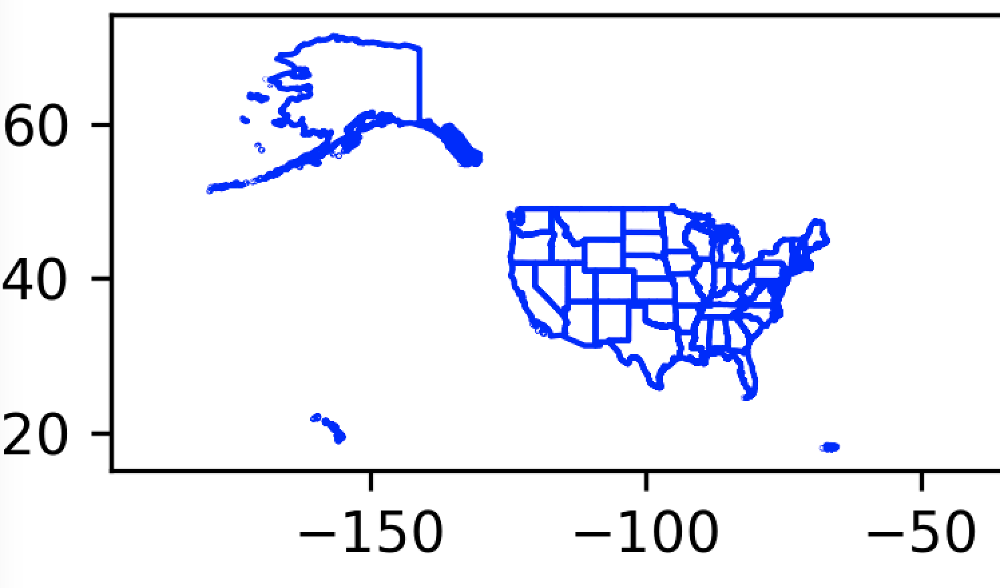

#### Maps in Python

My wife and I have done a lot of traveling, and I've made maps for most of the trips.  

Here is a map I just made that's a composite of highways I drove often in the 1980s when my Dad lived in Los Angeles, my girlfriend lived in San Francisco, and I lived in Salt Lake City.  You can probably guess that I used [Google Maps](https://www.google.com/maps/) and the directions function.  It has some nice [features](https://support.google.com/maps/answer/144361?hl=en&co=GENIE.Platform%3DDesktop).


This is great but it does have some limitations.  For example, there is a limit of 12 (?) waypoints.

Recently, I saw a post (I've lost the link now) of a road trip mapped by someone using Python (a bit like [this](https://cduvallet.github.io/posts/2020/02/road-trip-map) one).  I became intrigued with the idea of making maps using Python.

The github repo for this project is [here](https://github.com/telliott99/maps3).  

#### Shapefiles and GeoPandas

The standard format for mapping data is called a [shapefile](https://en.wikipedia.org/wiki/Shapefile), developed by ESRI (Environmental Systems Research Institute).  The data sets are very large, so these files were developed to store the information efficiently, in a binary format.  The spec is open.

Actually, they come as ``.zip`` files.

We do not want to know the details of the shapefile format, we just want the data.

I considered [GeoPandas](https://geopandas.org/en/stable/) as the best possibility for a Python project to deal with GIS (geographic information systems).

```
python3 -m pip install -U geopandas
```
Then

```
import geopandas as gpd

path = 'data/tl_2019_us_primaryroads.zip'
gdf = gpd.read_file(path)

```

[ For details about where to obtain shapefiles, see the last section, below.]

I did this in the interpreter, but I have removed the prompt (``>>>``) in some places to make it easy to copy-and-paste.

It's as simple as that.  The ``type`` of the data is ``'geopandas.geodataframe.GeoDataFrame'``.  ``gdf`` is short for GeoDataFrame.

A dataframe is basically just a table: 

```
>>> gdf.shape
(17495, 5)
>>> gdf.columns
Index(['LINEARID', 'FULLNAME', 'RTTYP', 'MTFCC', 'geometry'], dtype='object')
>>>
```
17495 rows and 5 columns.

Despite the name, ``us_primaryroads`` are almost entirely interstates.

#### Plotting

GeoPandas uses the ``matplotlib`` [library](https://matplotlib.org) for plotting.  This is "under the hood."  You can just call

```
>>> gdf.plot()
<AxesSubplot: >
>>>
```

Unfortunately, this doesn't work for me because I don't have the Python GUI.

I know of two other ways.  One is to use ``matplotlib`` directly, and the other is the Python [plotly](https://plotly.com/python/getting-started/) library.

To obtain matplotlib, just use ``pip`` as we did for geopandas above.  

Let's plot the US coastline, it's a bit simpler.

**example1.py**

```
import matplotlib.pyplot as plt
import geopandas as gpd

path = 'data/gz_2010_us_040_00_5m'
gdf = gpd.read_file(path)

fig,ax = plt.subplots(figsize=(7,7))
gdf.boundary.plot(ax=ax, 
    color='blue', linewidth=1)
    
plt.savefig('example.png', dpi=300)

```
This code has some issues, so I have cropped the image that was saved to show just a part of it.  The main point is that we successfully produced something sort of like what we want.



One peculiar thing that I don't understand:

- gpd opens ``tl_2019_us_primaryroads.zip`` 
- gpd will not open ``gz_2010_us_040_00_5m.zip``

One must first extract the latter file, and then ``gz_2010_us_040_00_5m`` works.

#### The "Pandas" way

The main thing that we have to figure out is how to approach the data in GeoPandas.  The Pandas way of doing things is to filter the rows of the dataframe like this:

```
import geopandas as gpd
path = 'data/tl_2019_us_primaryroads.zip'
df = gpd.read_file(path)
```
then construct an expression like ``df['RTTYP'] == 'I'``.  This compares row by row the value in the ``'RRTYP'`` column for equality with ``I`` (interstate).

```
>>> sel = df['RTTYP'] == 'I'
>>> sel.head()
0    False
1    False
2    False
3    False
4    False
Name: RTTYP, dtype: bool
>>>
```

The result is another dataframe, with a single column of boolean values.  We feed that to ``df``:

```
>>> sub = df[sel]
>>> sub
..
[5622 rows x 5 columns]
>>>
```

Actually, the usual way is to combine these:

```
 df[df['RTTYP'] == 'I']
```

which looks strange at first, but makes sense.

That's fine for a simple case.  To look for a particular road, we need to know more.  My approach (definitely not the Pandas way) is to explore the values in the ``'FULLNAME'`` column.

```
L = list(sub['FULLNAME'])
L = sorted(list(set(L)))
for e in L[:5]:
    print(e)
``
This prints

```
>>>
E I- 10
E I- 30
E I- 96
I- -69 Hov
I- 10
>>>
```

There are (only) three entries that don't start with 'I'.  

There is a space in 'I- 10' and other interstate names.  And sometimes, there is additional information like in ``I- -69 Hov``, which also has an extra dash.

```
>>> [e for e in L if e.startswith('I- 5 ')]
['I- 5 Local Byp', 'I- 5 Scn']
>>>
```

``startswith`` doesn't work with ``I- 5`` because then we get ``I- 55`` and more.  The above, with a space at the end, doesn't retrieve ``I- 5`` followed by a newline.

We need a more complicated selector.  But even this example fails:


```
>>> sel = sub['FULLNAME'].startswith('I- 5 ')
..
AttributeError: 'Series' object has no attribute 'startswith'
>>>
```
This gives an error.  The GeoPandas docs about indexing are [here](https://geopandas.org/en/stable/docs/user_guide/indexing.html) and the Pandas docs are [here](https://pandas.pydata.org/pandas-docs/stable/user_guide/indexing.html).  It's pretty grim reading and I haven't figured that out.

When the number of possibilities is limited, one solution is to filter for each one, then combine the results.  This works:

```
import geopandas as gpd
import pandas as pd

path = 'data/tl_2019_us_primaryroads.zip'
df = gpd.read_file(path)

i5 = df[df['FULLNAME'] == 'I- 5']
i5plus = df[df['FULLNAME'] == 'I- 5 Local Byp']
i5plus2 = df[df['FULLNAME'] == 'I- 5 Scn']

i5 = pd.concat([i5,i5plus,i5plus2])
print(i5.shape)
```
which prints:

```
(121, 5)
>>> 
```

Finally, we can save this data in its own shapefile:

```
ofn = 'I-5.shp.zip'
i5.to_file(filename=ofn,driver='ESRI Shapefile')
```
giving a ``zip`` and a ``.shp`` file inside.  

```
df2 = gpd.read_file(ofn)
df2.head()
```
This prints

```
df2.head()
        LINEARID  ...                                           geometry
0  1101917542860  ...  LINESTRING (-122.28837 41.18492, -122.28777 41...
1  1101917542861  ...  LINESTRING (-122.28855 41.18493, -122.28787 41...
2  1104492433937  ...  LINESTRING (-122.90274 46.38747, -122.90278 46...
3  1104486697510  ...  LINESTRING (-123.13800 43.75365, -123.13777 43...
4  1106081417251  ...  LINESTRING (-122.30344 48.29760, -122.29927 48...

[5 rows x 5 columns]
```

However, I'm probably not doing this exactly right because if I unzip, one of the files is ``I-5.shp.shp`` which seems wrong.

#### A simple plot

Having extracted the rows relating to one particular interstate into ``'I-5.shp.zip'`` we can try producing a map. 

Before doing that, let's work some more with the background layer of the plot.  I know there are a lot of shapefiles out there that already have the states combined, my source here is 

```
gz_2010_us_040_00_5m
```
The ``'STATE'`` column is the FIPS code, while the ``'NAME'`` column is the full name of the state.  I made a little dictionary 

```
fipsD = { 'AZ':'04','CA':'06','CO':'08',
          'ID':'16','MT':'30','NV':'32',
          'NM':'35','OR':'41','TX':'48',
          'UT':'49','WA':'53','WY':'56'}
```

and then I used the methods we've talked about

```
CA = df[df['STATE'] == fipsD['CA']]
OR = df[df['STATE'] == fipsD['OR']]
WA = df[df['STATE'] == fipsD['WA']]
west_coast = pd.concat([CA,OR,WA])
ofn = 'west_coast.shp.zip'
west_coast.to_file(
    filename=ofn,
    driver='ESRI Shapefile')
```

So then we can load just that data.

**example2.py**

```
import matplotlib.pyplot as plt
import geopandas as gpd
import subprocess

path = 'data/west_coast.shp.zip'
df = gpd.read_file(path)

fig,ax = plt.subplots(figsize=(7,7))
df.boundary.plot(ax=ax, 
    color='blue', linewidth=1)

ofn = 'example2.png'
plt.savefig(ofn, dpi=300)

cmd = ['open','-a','Preview',ofn]
subprocess.run(cmd)
```


Modify the code to also load the I-5 data which we saved

```
fn = 'I-5.shp.zip'
i5 = gpd.read_file(ofn)
i5.plot(ax=ax, 
    color='red', linewidth=2)
```


#### Basic form of the data

At this point, we want to escape the GeoPandas ecosystem.  Load the data for 

```
tl_2019_us_primaryroads.zip
```

```
import geopandas as gpd
import pandas as pd

path = 'data/tl_2019_us_primaryroads.zip'
df = gpd.read_file(path)
```

as before and then do

```
row_count = df.shape[0]
for i in range(row_count):
    item = df.loc[i]
    if not item['RTTYP'] == 'I':
        continue
```

It's a bit tricky, though.  If you have filtered a dataframe beforehand, then the indexes fo rows that have been removed are *not present*, so this code will throw an error.

For example, with I-5 I got

```
>>> sub.head()
            LINEARID  ...                                           geometry
12240  1101917542860  ...  LINESTRING (-122.28837 41.18492, -122.28777 41...
12241  1101917542861  ...  LINESTRING (-122.28855 41.18493, -122.28787 41...
12242  1104492433937  ...  LINESTRING (-122.90274 46.38747, -122.90278 46...
12243  1104486697510  ...  LINESTRING (-123.13800 43.75365, -123.13777 43...
12244  1106081417251  ...  LINESTRING (-122.30344 48.29760, -122.29927 48...

[5 rows x 5 columns]
>>> sub.loc[12240]
LINEARID                                        1101917542860
FULLNAME                                                 I- 5
RTTYP                                                       I
MTFCC                                                   S1100
geometry    LINESTRING (-122.28837 41.184923999999995, -12...
Name: 12240, dtype: object
>>> 
```
To extract the data inside a row you can do

```
        g = item['geometry']
        X,Y = g.xy
```

so ``X`` and ``Y`` are Python lists of the longitude and latitude points for each row.  Some rows may have hundreds of points, others may have only a few.

``dir(sub)`` will give hints for other things we might do with a row of data.

For example:

```
>>> sub.bounds
             minx       miny        maxx       maxy
12240 -122.642901  41.184924 -122.257704  42.005453
12241 -122.643193  41.184927 -122.258098  42.005441
12242 -122.915158  45.900732 -122.739856  46.387470
12243 -123.138001  43.749863 -123.005332  44.200079
12244 -122.317652  47.777618 -122.173910  48.297596
...           ...        ...         ...        ...
12352 -120.777338  36.074415 -120.098453  36.854870
12353 -121.447774  37.591050 -121.277493  38.255100
12354 -121.333388  37.246130 -121.088656  37.591050
12355 -123.374170  42.739484 -123.138000  43.753823
12356 -123.374009  42.739480 -123.138001  43.753697

[117 rows x 4 columns]
>>> 
```

```
>>> sub.bounds.loc[12240]
minx   -122.642901
miny     41.184924
maxx   -122.257704
maxy     42.005453
Name: 12240, dtype: float64
>>> list(_)
[-122.642901, 41.184923999999995, -122.257704, 42.005452999999996]
>>>
```

#### Playing with the data

I spent a *lot* of time playing with the data for interstates in the western United States.

The basic idea was to arrange the data extracted from the rows for an interstate into a series of segments that would proceed *in order* along a route.  Then the route could be filtered by locations where we started and stopped driving.

This did eventually work, for interstates.  Typical results might be

```
4r
32.5424,-117.0297
33.3965,-117.5937
326

16r
33.3965,-117.5937
33.8748,-118.0114
318
..

32r
48.6451,-122.3648
49.0021,-122.757
312
``` 

This is I-5, starting in San Ysidro.  For this representation, I switched to show the latitude first, because that's the way Google Maps works.  


You may notice that this precise lat,lon point (taken from the data), is actually in Mexico!

The example above shows three items which I called "segments".  Each segment comes from a row of the data, and consists of points that are *in order*.  The problem is that the rows themselves are not in order.  That's what my code builds.

Although it might have been the case that segments overlap, in practice they don't.  There are duplicates where one is the route from A to B and there is another which is the route from B to A.

But the general strategy was to start with A-B and find B-C, where the two B's might not be exactly the same point.  

The fourth line in each item is the orientation of the segment.  This was very helpful, because it clearly shows the places where the code gets confused and turns around.  The orientation is calculated from the result of 

```
math.degrees(math.atan((y2-y1)/(x2-x1))
```

The code to transform this result, in trigonometric degrees, to compass degrees, was surprisingly tricky.  It handles the four quadrants individually:

```
    # Q1
    if dx > 0 and dy > 0:
        at = degrees(atan(m))
        return  90 - at

    # Q2, make the slope positive
    # this makes it a mirror image of Q1
    if dx < 0 and dy > 0:
        m *= -1
        at = degrees(atan(m))
        return 270 + at
```

Ultimately, I wrote code that can generate a route entirely "hands off", say for I-10.  For others like I-5, a little handwork was necessary.

However, this could only be extended to US Highway 101 with some difficulty.  The problem is that the highway data is not good enough.

And then finally I realized that this not really unnecessary.

We can just filter all the points in a highway for those that are inside a box.  This code uses another feature in GeoPandas called  ``.bounds``:

```
def filter_bounds(
    df,vmin,vmax,latitude=True):
    # the pandas way
    df = pd.concat([df, df.bounds], axis=1)
    if latitude:
        df = df[df['miny'] > vmin]
        df = df[df['maxy'] < vmax]
    else:
        df = df[df['minx'] > vmin]
        df = df[df['maxx'] < vmax]
    return df
```

We feed the min and max latitude (or longitude) to this function.  Inside, we produce a modified dataframe that has the bounds for each segment.  The filter is for segments with bounds that do not exceed the min and max values.  Those values are based on the start and end points.

For a NS route like I-5, we use the latitude.

The result looks like this


A couple points:

- we've adjusted the projection for the map

This is done by

```
def albers(df):
    return df.to_crs("ESRI:102003")
```

and then 

```
albers(hwy).plot(
        ax=ax, color='blue', linewidth=2)
```

The red (the part we've selected) is overlayed on the whole length of the highway.

Somewhat embarassing is that there is a section missing in the middle.  That's because this was done yesterday, and it was only today that I figured out how to do

```
i5 = df[df['FULLNAME'] == 'I- 5']
i5plus = df[df['FULLNAME'] == 'I- 5 Local Byp']
i5plus2 = df[df['FULLNAME'] == 'I- 5 Scn']

i5 = pd.concat([i5,i5plus,i5plus2])
```

which gets *all* of the I-5 data.

At this point, it's clear that in principle, I can do what I set out to do.  We'll stop here with an example that I worked up for a previous write-up.  That's where we're headed, but this thing is long enough already.


#### Data sources

Many vendors sell maps, so map data is valuable.  The original source for highway data of the U.S. is the US Census.  The first source I came across was a guy named Eric Celeste ([link](https://eric.clst.org/tech/usgeojson/)), but I eventually stumbled across official download pages.

US primary roads (i.e. interstates) are [here](https://catalog.data.gov/dataset/tiger-line-shapefile-2019-nation-u-s-primary-roads-national-shapefile).  

The file I've used is:

``'tl_2019_us_primaryroads.zip'`` 

Searching further, I found a page with the title TIGER/Line Shapefiles where you select the year [here](https://www.census.gov/geographies/mapping-files/time-series/geo/tiger-line-file.2020.html#list-tab-790442341).

Selecting 2020 and then Download > Web Interface leads [here](https://www.census.gov/cgi-bin/geo/shapefiles/index.php).  

Selecting layer type:  roads leads [here](https://www.census.gov/cgi-bin/geo/shapefiles/index.php?year=2020&layergroup=Roads).  Select a state and mash the Download button and you're good.

Instead, select layer type:  State and year 2010 and you can download all the states are each individual state.  

I did the latter for the Western states and got files like

```
tl_2010_53_state10.zip
```
``53`` is the FIPS code for the state of Washington.  I suppose ``10`` is the resolution.


US secondary roads are available for each state (coded by [FIPS](https://en.wikipedia.org/wiki/Federal_Information_Processing_Standards)) code.  A list of codes by state and county is [here](https://transition.fcc.gov/oet/info/maps/census/fips/fips.txt).

When plotting a map, it's crucial to have geographic boundaries.  The national coastline is [here](https://www.census.gov/cgi-bin/geo/shapefiles/index.php?year=2022&layergroup=Coastline).  

The 50 states plus D.C. plus Puerto Rico are [here](https://www.census.gov/cgi-bin/geo/shapefiles/index.php?year=2022&layergroup=States+%28and+equivalent%29).

Actually, the file I've used most is

``gz_2010_us_040_00_5m.zip``

Often, these data files come in 3 different resolutions:  40m (low), 5m (medium) and 500k (high).  It's counterintuitive, I know.

This is a cartographic boundary file and the download link is [here](https://www.census.gov/geographies/mapping-files/time-series/geo/carto-boundary-file.2010.html#list-tab-1556094155).

That page contains a variety of useful links, including a different version of the US boundary data.
