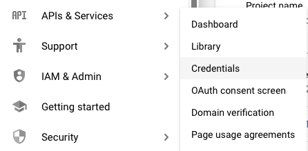

I'm working on a mapping project.  One idea is to make a map of the US with road trips on it.  See [here](https://www.kexinzhang.com/2018/07/02/google-maps-to-geojson.html).

For the route part, I'm going to try to do what he did and use the Google Directions API.

To do that I needed to login to Google cloud, set up an account and start a first project.

Log in is easy, if I'm already logged into blogger.

I forget exactly how I set up the account and project, but it was pretty easy.

Today I'm trying to go further.  So I was able to get a Google Directions API Key.

google:  google cloud dashboard click signin
automatically takes me to the main Dashboard page.

At the top left, it says My First Project with a drop-down menu.

Click on My First Project and it just takes you back to the Dashboard.

What you want is APIs & Services from the menu on the left.

Click on Credentials

Create credentials

API Key is saved in pw file (y.txt.enc)

If you click on the API Key you should see an option to restrict requests to a particular IP address.

My IP address is supposed to be dynamic, but since the host is Comcast, they're simply lying about it.

I just Google my ip and it gives me the address as IPv6.  (I tried IPv4 and it didn't work).

So then, my first request to Google was his example:

https://maps.googleapis.com/maps/api/directions/json?origin="2131 7th Ave, Seattle, WA 98121"&destination="900 Poplar Pl S, Seattle, WA 98144&key=<API KEY>"

but modified with my endpoints and API KEY:

https://maps.googleapis.com/maps/api/directions/json?origin="Los Angeles, CA, 90004"&destination="San Francisco, CA, 9"&key=<MY API KEY>

We'll look at the json in another write-up